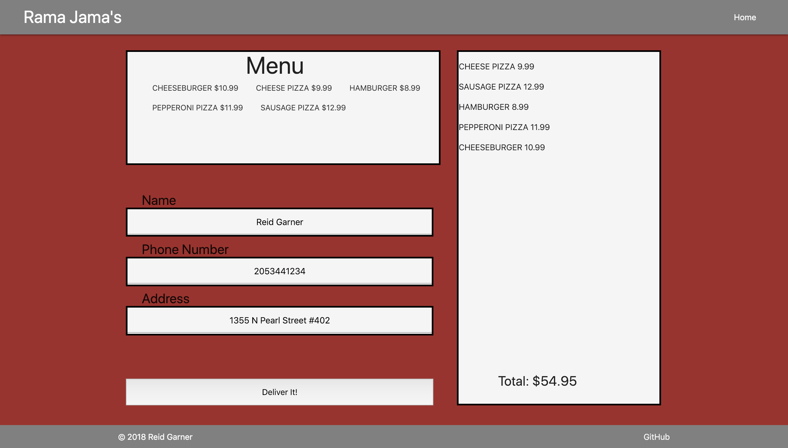

# Galvanize Eats

## Description: 
Allows the user to pick items from a menu, add their quantity of said items, input their name, telephone number, and address to deliver an order.

## Project Images: 

### Home Page

### Place an order

### Technologies Used:
- Javascript
- Materialize
- HTML5
- CSS3
- Flexbox 

### Repo Link:
- https://github.com/reidgarner/Galvanize-Eats-Rama-Jamas

### Deployed site:
- https://reids-g-eats.surge.sh

### Installation and Run:
- $ npm install lite-server
- $ lite-server
